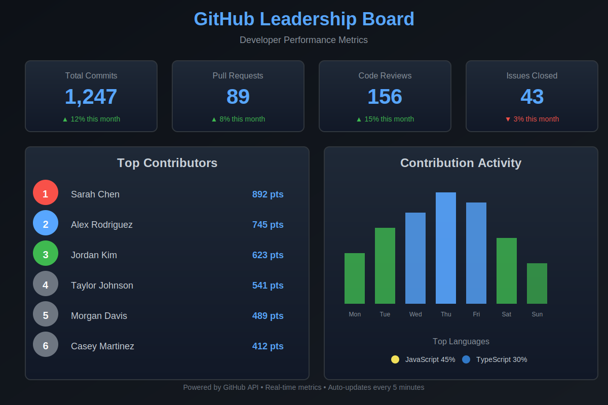

# GitHub Leadership Board 🏆



A beautiful, web-based dashboard that pulls developer metrics from GitHub projects and displays them in an interactive leaderboard format. Track commits, pull requests, code reviews, issues, and more!

## Features

✨ **Real-time GitHub Data** - Fetches live metrics from GitHub API  
📊 **Beautiful Visualizations** - Modern, responsive design with charts and graphs  
🏅 **Contributor Leaderboard** - Rank developers by weighted performance scores  
📈 **Activity Tracking** - Daily contribution graphs and trends  
💻 **Language Analytics** - See what languages your team uses most  
🎯 **Customizable** - Filter by organization, repository, and time range  

## Quick Start

1. **Clone or download this repository**
2. **Open `index.html` in your web browser**
3. **Enter your GitHub information:**
   - Organization or username (e.g., `microsoft`, `facebook`, or your username)
   - Optional: Repository name (leave blank for all repos)
   - Optional: GitHub Personal Access Token (for private repos and higher rate limits)
4. **Click "Load Dashboard"** and watch your metrics come to life!

## GitHub Personal Access Token

For public repositories, you can use the dashboard without a token, but you'll be limited to 60 requests per hour. For private repositories or higher rate limits (5,000 requests/hour), create a token:

1. Go to [GitHub Settings → Tokens](https://github.com/settings/tokens)
2. Click "Generate new token (classic)"
3. Give it a name like "Leadership Board"
4. Select scopes: `repo` (for private repos) or just `public_repo` (for public only)
5. Click "Generate token" and copy it
6. Paste it into the dashboard's token field

**Note:** Keep your token private! Never commit it to a repository.

## Metrics Explained

### Scoring System
Contributors are ranked using a weighted scoring system:
- **Commits**: 1 point each
- **Pull Requests**: 5 points each
- **Code Reviews**: 3 points each
- **Issues Closed**: 2 points each

### Dashboard Sections

1. **Top Stats Cards** - Overview of total activity across all repositories
2. **Top Contributors** - Leaderboard showing your team's most active developers
3. **Contribution Activity** - Weekly chart showing commit patterns
4. **Top Languages** - Breakdown of programming languages used
5. **Detailed Stats Table** - Complete contributor breakdown with all metrics

## Customization

You can easily customize the scoring weights or add new metrics by editing `app.js`:

```javascript
// In calculateContributorScores() function
contributor.score = 
    (contributor.commits * 1) +      // Change these weights
    (contributor.prs * 5) +
    (contributor.reviews * 3) +
    (contributor.issues * 2);
```

## Technology Stack

- **Pure HTML/CSS/JavaScript** - No frameworks required!
- **GitHub REST API v3** - Official GitHub API
- **Canvas API** - For activity charts
- **CSS Grid & Flexbox** - Modern responsive layout

## Browser Support

Works in all modern browsers:
- Chrome/Edge (latest)
- Firefox (latest)
- Safari (latest)

## Limitations

- GitHub API rate limits apply (60 requests/hour without token, 5000 with token)
- Fetches up to 10 repositories to avoid rate limiting (can be adjusted in code)
- Activity data based on the selected time range only

## Contributing

Feel free to fork this project and submit pull requests! Some ideas for enhancements:
- Add more chart types (pie charts, line graphs)
- Export data to CSV/PDF
- Historical trend comparisons
- Team vs team comparisons
- Integration with other platforms (GitLab, Bitbucket)

## License

MIT License - feel free to use this for personal or commercial projects!

## Support

If you encounter issues:
1. Check the browser console for errors
2. Verify your GitHub token has the correct scopes
3. Ensure the organization/user exists and is accessible
4. Check that you haven't exceeded API rate limits

## 🚀 Deploy Your Own Leadership Board

Want your own real-time GitHub Leadership Board?  
It’s easy—no coding required!

**Try the live demo:**  
[https://vercel.com/april-drakes-projects/leadership-board](https://vercel.com/april-drakes-projects/leadership-board)

**To deploy your own:**
1. **Fork or clone this repo** to your GitHub account.
2. **Go to [Vercel](https://vercel.com/import/git)** and import your forked repo.
3. When prompted for a framework, select **Other**.
4. Click **Deploy**—that’s it!  
   Vercel will give you a public URL for your own dashboard.

**Customize:**  
- Edit the Organization/User and Repository fields in the dashboard UI to track any public or private repo.
- For private repos or higher API limits, use a GitHub Personal Access Token.

---

Made with ❤️ for development teams everywhere
